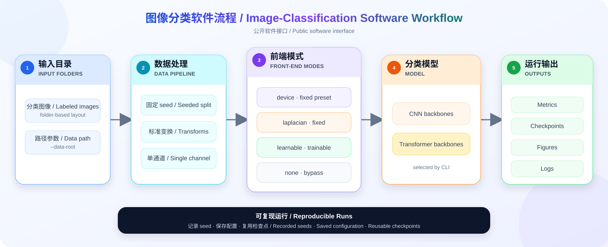

# PhotosistorsNetwork

<p align="right"><a href="README.md">中文</a> | <strong>English</strong></p>

Software for running reproducible image-classification workflows.

> This page documents only the public software interface and usage.

## Features

- Four front-end modes: `device`, `laplacian`, `learnable`, and `none`
- Five classification backbones: `resnet18`, `mobilenet_v2`, `densenet121`, `vit`, and `swin`
- Seeded stratified train/validation/test splitting
- Best-validation checkpoints, early stopping, and configuration records
- Classification metrics, confusion matrices, learning curves, and Grad-CAM visualization
- Compatibility with current checkpoints and legacy plain `state_dict` files

## Software Workflow

<p align="center">
  
</p>

## Operator Interface

For a fixed 3×3 matrix \(K\) and grayscale input \(X\), the front end computes

$$
Y_{b,1,u,v}=\sum_{i=0}^{2}\sum_{j=0}^{2}
K_{ij}X_{b,1,su+i,sv+j},
\qquad s=3.
$$

All convolutional front ends use 1→1 channels, kernel size 3, stride 3, no padding, and no bias. `device` is the backward-compatible CLI name for a fixed preset; the preset is not updated during training.

| Mode | Front end | Parameter state |
|---|---|---|
| `device` | Preset fixed 3×3 kernel | Frozen |
| `laplacian` | Fixed Laplacian 3×3 kernel | Frozen |
| `learnable` | Randomly initialized 3×3 convolution | Trainable |
| `none` | No front end | Not applicable |

The front end is an additional module before the classification backbone; the backbone input layer is separately adapted for single-channel input.

## Installation

Python 3.10 or 3.11 is recommended. For a CPU environment:

```powershell
python -m venv .venv
.\.venv\Scripts\Activate.ps1
python -m pip install --index-url https://download.pytorch.org/whl/cpu torch==2.7.1 torchvision==0.22.1
python -m pip install -r requirements.txt
```

For CUDA, select PyTorch 2.7.1 and torchvision 0.22.1 builds compatible with the local environment; the remaining pinned versions are listed in [`requirements.txt`](requirements.txt). `--pretrained` may download external backbone weights and is disabled by default.

## Data

Default classification-data directory:

```text
data/raw/UCMerced_LandUse/Images/
├─ <class-name>/
├─ ...
└─ <class-name>/
```

The loader checks that the class directories match the software configuration; use `--data-root` for another location. See [`data/raw/UCMerced_LandUse/readme.txt`](data/raw/UCMerced_LandUse/readme.txt) for the third-party source and usage terms.

## Usage

CPU smoke test for all four modes:

```powershell
python -m scripts.train `
  --backbones resnet18 `
  --kernels device laplacian learnable none `
  --batch-size 2 `
  --num-workers 0 `
  --device cpu `
  --smoke-test
```

Minimal training example:

```powershell
python -m scripts.train `
  --backbones resnet18 `
  --kernels device learnable `
  --epochs 100 `
  --patience 10 `
  --seed 42
```

Visualization after training:

```powershell
python -m scripts.visualize `
  --exp-dir experiments/LandUse_Classification_YYYYMMDD_HHMMSS `
  --backbone resnet18 `
  --kernel device `
  --max-samples 100
```

Use `python -m scripts.train --help` and `python -m scripts.visualize --help` for all options.

## Outputs and Reproducibility

Results are written to `experiments/<run_name_timestamp>/`, including configuration JSON, per-epoch metrics, test metrics, confusion matrices, figures, logs, and the best model.

The default split is 60%/20%/20%. The best validation-Accuracy checkpoint is restored before testing. Retain each seed, configuration, and corresponding result when repeating runs.

## License

- Dependency versions are pinned in [`requirements.txt`](requirements.txt).
- Original project code is released under the [MIT License](LICENSE). Third-party data and external weights retain their respective source terms.
